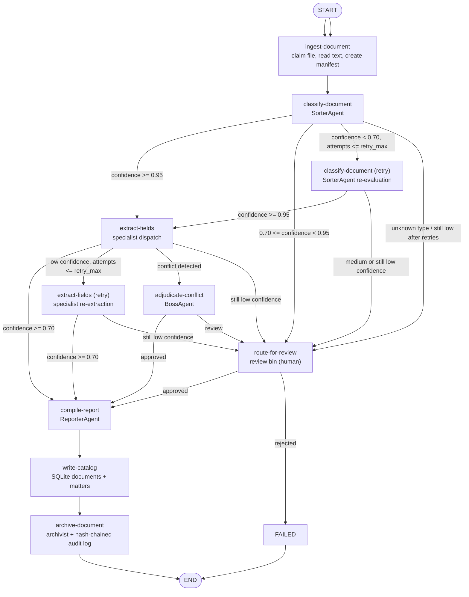
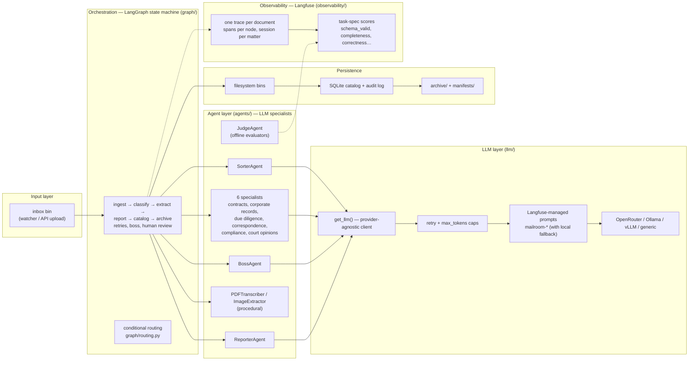

# Mailroom — Multi-Agent Legal Document Processing Pipeline

Mailroom is a multi-agent pipeline that ingests high-volume legal documents for a transactional/corporate practice, classifies them, routes them to specialist agents for extraction, compiles the results into a matter record, and archives everything with a full audit trail. Every step is traced to Langfuse, scored against task-spec evaluators, and auditable end-to-end.

---

## Quick Start

> **No database server needed.** Mailroom stores everything (catalog + audit log + crash-resume checkpoints) in a plain **SQLite file** inside your data folder. If you don't already use Docker, you can ignore it entirely.

```bash
# 1. Configure
cp .env.example .env
# Edit .env — add your OPENROUTER_API_KEY (and LANGFUSE_* keys for tracing)

# 2. Install
pip install -e ".[dev]"

# 3. (Optional) Start Langfuse for trace viewing — needs Docker
docker compose -f src/config/docker/docker-compose.yml up -d postgres clickhouse langfuse-server

# 4. (Optional) Sync the agent prompts into Langfuse prompt management
PYTHONPATH=src python src/scripts/sync_prompts.py

# 5. Run the watcher (starts processing documents from inbox)
PYTHONPATH=src python -m pipeline.watcher

# 6. In another terminal, start the API
PYTHONPATH=src python -m api.main

# 7. Upload a document
curl -X POST http://localhost:8000/upload \
  -F "file=@tests/fixtures/contract/sample_msa.txt" \
  -F "matter_id=MATTER-001"

# 8. Check pipeline status
curl http://localhost:8000/status/{doc_id}

# 9. View full audit trail
curl http://localhost:8000/audit/{doc_id}
```

When a document is processed, you'll get two files under `data/`:
- `data/mailroom.db` — the SQLite database (matters, documents, audit_log tables)
- `data/checkpoints.db` — LangGraph crash-resume state

## Architecture

One **LangGraph state machine run per document** — 11 nodes, SQLite-checkpointed and crash-resumable. Files move through filesystem bins (`inbox → processing → archive | review | failed`); every decision is a named node with a deterministic trace in Langfuse.

### LangGraph state machine



Thresholds (`confidence.low`, `confidence.high`, `retry_max`) are config in `config/taxonomy.yaml`, never hardcoded.

### Hierarchical organization



## Design Principles

1. **Auditability over cleverness.** Every classification, extraction, and routing decision is traceable (Langfuse trace per document, hash-chained audit log per archive).
2. **Explicit over emergent.** Orchestration is a defined state machine — agents don't freely negotiate.
3. **Human-legible state.** Filesystem bins let anyone `ls` a folder and understand where a document is.
4. **Provider-agnostic LLM layer.** OpenRouter today, local models later — one config change.
5. **Redundant record-keeping.** Audit trail doesn't depend on any single tool staying alive.
6. **Config over code.** Taxonomy, thresholds, model mappings, retry tuning, and per-agent token caps all live in `config/taxonomy.yaml`.

## Project Structure

The repository root holds only the essentials — `src/` (all code), `data/`
(runtime state), `docs/` (documentation + reference material), plus the
tooling files. Everything else is nested:

```
mailroom/
├── src/             # ALL Python code
│   ├── agents/          # Specialist agents (Sorter, Contract, Corp Records, Judge, …)
│   ├── langchain_agents/# Vendored LangChain agents (Sorter, Contracts Specialist) from llm-entity-extraction
│   ├── graph/           # LangGraph state machine: nodes, routing, state
│   ├── llm/             # Provider-agnostic LLM client, retry, Langfuse-managed prompts
│   ├── schemas/         # Pydantic models: manifest, matter, documents, audit
│   ├── pipeline/        # Watcher, filesystem bins, ops monitor
│   ├── storage/         # SQLite/Postgres: catalog CRUD, audit log
│   ├── api/             # FastAPI: upload, review, status, audit
│   ├── observability/   # Langfuse tracing + task-spec scores + deterministic field scoring
│   ├── config/          # taxonomy.yaml — doc classes, thresholds, model mappings
│   │   └── docker/      # docker-compose: Langfuse, Ollama (Postgres optional)
│   ├── legalbench/      # LegalBench evaluation suite (binary QA + family classification)
│   ├── scripts/         # ops & eval: run_pilot, run_quality_judges, run_vision_sweep, sync_*, cutover, compare_runs, fetch_full_cuad, validate_pipeline
│   └── tests/           # pytest: unit, routing, e2e, judge, fixtures
├── data/             # runtime state: inbox/processing/archive bins, mailroom.db, cuad/ corpus, manifests/
└── docs/             # canonical user docs (agents, architecture, configuration, deployment, local-models)
    ├── reports/      # evaluation write-ups: audits/, pilots/, evaluations/ (see docs/reports/README.md)
    ├── examples/     # sample documents + manifest ground truth (samples/, sources/, external/)
    └── wiki/         # GitHub-wiki-only pages, pushed to the GitHub wiki via docs/wiki/sync-wiki.sh (NOT a docs/ mirror)
```

All code runs with `src/` on the import path (`PYTHONPATH=src`), so intra-repo
imports keep their plain package names (`from pipeline import …`).

## Configuration

All config lives in `config/taxonomy.yaml` — **never hardcoded**:

```yaml
# Add a doc class:
doc_classes:
  - key: new_doc_type
    label: "New Document Type"
    schema: NewExtractionSchema
    specialist: new_specialist

# Adjust thresholds:
confidence:
  high: 0.95       # classification >= this → auto-continue to extraction
  low: 0.70        # below this → retry → still low → human review
  retry_max: 1     # max retries before routing to review

# Transient-failure LLM retries (connection errors, 429, 5xx):
llm_retry:
  max_attempts: 3
  base_delay: 1.0
  max_delay: 30.0

# PDF transcription: skip the LLM reformat pass for text-based PDFs whose
# extraction yields at least this many chars/page (scanned PDFs still go to LLM):
pipeline:
  pdf_direct_chars_per_page: 800

# Per-agent model mapping + output token caps (caps runaway reasoning output):
agents:
  sorter:
    provider: openrouter
    model: qwen/qwen3.7-flash
    temperature: 0.1
    max_tokens: 2048
```

## LLM Providers

| Provider | Status | Auth | Base URL |
|---|---|---|---|
| **OpenRouter** | Primary | `OPENROUTER_API_KEY` | `https://openrouter.ai/api/v1` |
| **Ollama** | Local | None | `http://localhost:11434/v1` |
| **vLLM** | Local | None | `http://localhost:8000/v1` |
| **Generic** | Fallback | `GENERIC_API_KEY` | Configurable |

Global override: set `DEFAULT_PROVIDER=ollama` in `.env`.

All LLM calls go through `retry_chat_completion` (`llm/retry.py`): transient failures (`APIConnectionError`, timeouts, rate limits, 5xx) are retried with exponential backoff + jitter; 4xx client errors (e.g. malformed requests) are never retried.

## Prompt Management

Every agent's system prompt is a **Langfuse-managed prompt** (`mailroom-<agent_name>`, type `text`, `production` label) — versioned, editable without a deploy, and linked to every generation in the trace UI.

```bash
# Push the local prompt templates to Langfuse (idempotent: only new versions on change)
PYTHONPATH=src python src/scripts/sync_prompts.py
PYTHONPATH=src python src/scripts/sync_prompts.py --dry-run   # preview
PYTHONPATH=src python src/scripts/sync_prompts.py --agent sorter
```

The code ships the same templates as fallbacks (`llm/prompts.py`): if Langfuse is disabled or unreachable, the pipeline runs identically on the local defaults. The `json_object` response-format boilerplate stays hardcoded — some providers require the literal token `json` in the messages.

## Observability

- **Tracing** — every LLM call (prompt, response, tokens, latency) is auto-logged to **Langfuse** (cloud or self-hosted) or **Braintrust**, selected via `OBSERVABILITY_PROVIDER` in `.env`. One trace per document, one span per node, `session_id = matter_id` (or a run-scoped session for pilot runs), deterministic trace ids seeded from filenames. Optional — the pipeline runs fine with tracing disabled.
- **Scores** — every run emits self-evident scores (`parse_error`, `schema_valid`, `stage_completed`, confidence values); pilot runs add ground-truth scores (`class_correct`, `stage_correct`, calibration error). Score configs are auto-created by `observability/scores.py` (`ensure_score_configs()`).
- **Run-log mirroring** — pull traces (with observations + scores) into the repo for offline analysis by subagents:

```bash
PYTHONPATH=src python src/scripts/sync_langfuse_logs.py                    # last 24h
PYTHONPATH=src python src/scripts/sync_langfuse_logs.py --since 7d --limit 100
PYTHONPATH=src python src/scripts/sync_langfuse_logs.py --trace-id <id>
# → data/langfuse_logs/<run>/<trace_id>.json + index.json
```

- **Audit log** — append-only, SHA-256 hash-chained entries in SQLite (tamper-evident)
- **Manifest sidecar** — JSON file archived alongside every document (self-contained record)

## Evaluators & Quality

### Deterministic field scoring (issues #4/#5)

Before any LLM judge runs, every grounded extraction gets a **field-type-aware deterministic score** (`observability/field_scoring.py`) — cheap, reproducible, zero API cost:

- `date` / `id` / `money` — parse + normalize, then exact match (a one-day-off date scores 0, not 0.95)
- `name` — normalized fuzzy match (Jaro-Winkler + token-set ratio, suffix-stripping)
- `free_text` — SQuAD-style token F1 (optional sentence-transformers embedding rescue for paraphrases)
- `entity_list` — optimal bipartite matching (Hungarian) → precision/recall/F1 (order-agnostic)

Per-field-type judge-escalation bands (`field_scoring.type_bands` in `taxonomy.yaml`) are **calibrated** by `scripts/calibrate_field_scoring.py` against labeled ground truth: date/id are decisive (`never` escalate), money/free_text have calibrated cutoffs, name and entity-list trust only perfect scores and escalate everything else to the LLM judge. On grounded runs the pipeline suppresses the `pipeline-result` generation entirely when the verdict is unambiguous — saving both evaluator calls. The same scores are attached to traces via `observability/langfuse_field_scoring.py` (`extraction_field_score`, `extraction_overall_score`, `extraction_needs_judge_review`, `entity_list_precision`, `entity_list_recall`).

### LLM-as-a-judge

Mailroom evaluates its own work against the **task specification** (the taxonomy doc classes + extraction schemas) using a dedicated `judge` agent. Judge dimensions:

| Judge | What it measures | Scores |
|---|---|---|
| `classification` | Is the sorter's assigned class correct for the document (audited against the taxonomy spec)? | `classification_correct`, `classification_quality` |
| `completeness` | Did the specialist capture every field the document actually states? | `completeness`, `completeness_label` |
| `correctness` | Are extracted field values factually accurate (no fabrication)? | `extraction_correctness`, `extraction_correctness_label` |

The same rubrics are **configured as two independent live LLM-as-a-Judge evaluators in the Langfuse project**. The pipeline emits one `pipeline-result` generation per document trace, and two observation rules independently evaluate it: `mailroom-pipeline-judge` returns a **CORRECT/PARTIAL/MISS** verdict, while `mailroom-pipeline-quality` returns a proportional **0.0-1.0 quality score**. A substantially correct extraction with limited material gaps earns `PARTIAL` instead of a hard `MISS`, and still receives a useful quality score; the numeric score never replaces or alters the run verdict. Grounded runs skip document text in the judge input — the input is a labeled, pretty-printed expected-fields block and the output is a cleaned schema-only extraction, cutting ~90% of judge tokens. Live runs without ground truth fall back to rubric judgment:

```bash
PYTHONPATH=src python src/scripts/sync_evaluators.py        # create/update evaluator + rule (idempotent)
PYTHONPATH=src python src/scripts/sync_evaluators.py --dry-run
PYTHONPATH=src python src/scripts/sync_evaluators.py --disable   # pause the rule
```

`sync_evaluators` also ensures the project has an LLM connection for the judge provider (OpenRouter, key from `.env`) so both evaluators can run. Deployed: `mailroom-pipeline-judge` + `mailroom-pipeline-rule` (CORRECT/PARTIAL/MISS verdict), and `mailroom-pipeline-quality` + `mailroom-pipeline-quality-rule` (proportional quality), all targeting `pipeline-result`. Old per-agent evaluators/rules are pruned automatically. Pilot runs additionally receive deterministic ground-truth scores (`class_correct`, `stage_correct` — binary 0/1 against the manifest; `expected_field_presence` — fraction of required expected fields extracted non-empty) attached by `run_pilot.py --scores`.

### Evaluation dataset

The pilot samples are mirrored into the **`mailroom-pilot` Langfuse dataset** (PDF text + ground truth incl. per-field `expected_fields` + manifest metadata) for experiments and judge calibration:

```bash
PYTHONPATH=src python src/scripts/sync_dataset.py            # 30 items, deterministic ids (upsert-safe)
PYTHONPATH=src python src/scripts/sync_dataset.py --include contract
```

### Offline judges over a pilot run

```bash
PYTHONPATH=src python src/scripts/run_pilot.py --real --scores        # needs OPENROUTER_API_KEY
PYTHONPATH=src python src/scripts/run_quality_judges.py --real        # LLM-as-a-judge on every sample
PYTHONPATH=src python src/scripts/run_quality_judges.py --mock        # deterministic fake judge
PYTHONPATH=src python src/scripts/run_quality_judges.py --judges classification,completeness
```

Judges attach scores to each sample's trace (configs auto-created), print a per-class calibration summary, and append an `evaluation` section to the pilot report. For production traces with no ground truth, the live Langfuse evaluators above cover the same dimensions automatically.

## Guardrails

Agents are LLMs — they can return junk even when the provider call succeeds. `pipeline/guards.py` is the deterministic safety net between raw agent output and routing decisions:

- **Classification guard** — doc type must be in the taxonomy and confidence in `[0,1]`; unknown types still route to human review, out-of-range confidence is discarded.
- **Extraction guard** — every extraction is JSON-parsed and validated against its Pydantic schema; a parse failure or schema violation clamps confidence below the routing threshold, forcing retry → human review instead of trusting bad output.

Triggered guards are logged (`extraction_guardrail_triggered`), recorded on the state (`extraction_guardrail`), and scored (`guardrail_triggered`). On top of this, all LLM calls carry `max_tokens` caps and transient-failure retries.

## Logging

Structured logging via `pipeline/logging.py` (`setup_logging()`, called by every entrypoint): level from `LOG_LEVEL` (default `INFO`), renderer from `LOG_FORMAT` (`pretty` console or `json` for machine parsing). Noisy third-party loggers (httpx, openai, langfuse, opentelemetry) are silenced to WARNING.

## Local Model Cutover

```bash
# See current agent→model assignments
PYTHONPATH=src python src/scripts/cutover.py --list

# Move sorter to local (safest first step)
PYTHONPATH=src python src/scripts/cutover.py --agent sorter --provider ollama --model qwen3:7b

# Validate with tests
PYTHONPATH=src python src/scripts/cutover.py --validate --agent sorter

# View recommended cutover order
PYTHONPATH=src python src/scripts/cutover.py --recommend

# Cut all agents at once
PYTHONPATH=src python src/scripts/cutover.py --all --provider ollama --model qwen3:7b
```

### Available Local Models (Ollama)

| Model | Sizes | Best For |
|---|---|---|
| Qwen 3 | 7b, 14b | Structured output, legal text extraction |
| Qwen 2.5 | 14b, 32b | Multilingual support |
| Llama 3.1 | 8b, 70b | General-purpose, reliable structured output |
| Llama 3.2 | 3b | Lightweight classification |
| Mistral | 7b | Fast instruction following |
| Mistral Nemo | 12b | Speed/quality balance |
| Mixtral | 8x7b | Strong extraction (MoE) |
| DeepSeek-R1 | 8b, 14b | Legal reasoning and analysis |
| Phi-4 | 14b | Document understanding |
| Gemma 2 | 9b, 27b | Instruction following |
| Command R | 35b, 104b | RAG and extraction |

## API Endpoints

| Method | Path | Description |
|---|---|---|
| `GET` | `/health` | Health check (includes LLM provider + DB dependency checks) |
| `POST` | `/upload` | Upload document to inbox |
| `POST` | `/review/{doc_id}/resolve` | Resolve human review (approved/rejected) |
| `GET` | `/status/{doc_id}` | Document pipeline status |
| `GET` | `/matters/{matter_id}` | All documents in a matter |
| `GET` | `/audit/{doc_id}` | Hash-chained audit trail + validity check |
| `GET` | `/ops/status` | Pipeline-wide operational metrics |
| `POST` | `/ops/sweep` | Run a one-off Boss ops-monitor sweep |
| `POST` | `/ops/pause` | Pause ingestion (writes the `ops_monitor_paused` flag the watcher honors) |
| `POST` | `/ops/resume` | Clear the ingestion-pause flag |

## Pipeline Bins (Filesystem)

```
data/
  pipeline/
    inbox/               # New uploads land here
    processing/<id>/     # Claimed by worker (atomic rename)
    classified/<type>/   # Sorted, pending specialist
    review/              # Human review required
    failed/              # Unrecoverable errors
  archive/
    <matter_id>/<type>/  # Final durable home
  manifests/
    <doc_id>.json        # Mirror of DocumentManifest
  mailroom.db            # SQLite: matters, documents, audit_log
  checkpoints.db         # LangGraph crash-resume state
  langfuse_logs/         # Mirrored run logs (scripts/sync_langfuse_logs.py)
```

## Testing

```bash
# Run all tests
pytest tests/ -v

# Run specific test suites
pytest tests/test_agents/ -v
pytest tests/test_routing.py -v
pytest tests/test_audit_log.py -v
pytest tests/test_pipeline_e2e.py -v

# With coverage
pytest tests/ --cov=. --cov-report=html
```

Tests never hit a real LLM — the OpenAI client and `BaseAgent.__init__` are mocked (see `tests/conftest.py`).

## Pilot Testing & Evaluation

A ready-made set of **30 pilot samples** lives in `docs/examples/samples/` (real SEC-exhibit contracts from the CC-BY-4.0 [CUAD](https://huggingface.co/datasets/theatticusproject/cuad) dataset, LegalBench MAUD merger agreements, public-domain Pile of Law court opinions, plus original text for the other doc classes — see `docs/examples/README.md`). Use them to pilot the pipeline and **measure the effect of procedural changes** on accuracy, efficiency, and quality:

```bash
# Build the sample PDFs into data/samples/ (gitignored)
PYTHONPATH=src python src/scripts/prepare_samples.py

# Deterministic run (fake LLM, no API key) — tests the machinery
PYTHONPATH=src python src/scripts/run_pilot.py --mock

# Real run (needs OPENROUTER_API_KEY in .env) — measures LLM accuracy too
PYTHONPATH=src python src/scripts/run_pilot.py --real --scores

# Diff two runs, e.g. after a routing/threshold change
PYTHONPATH=src python src/scripts/run_pilot.py --mock --baseline data/pilot_report.json

# LLM-as-a-judge over the run: classification, completeness, correctness
PYTHONPATH=src python src/scripts/run_quality_judges.py --real
```

The report records per-document stage, doc type, confidence, retries, LLM call count, wall time, and extracted data, and scores each against the ground truth in `docs/examples/samples/manifest.csv`. See `docs/examples/samples/README.md`.

## Full CUAD Corpus (issue #9)

The **complete CUAD v1 dataset** (510 annotated contracts, 20,910 clause annotations, PDFs + plain text + master clause taxonomy) can be downloaded and validated against the pipeline's 25-family contract-subtype taxonomy:

```bash
# Download everything into data/cuad/ + write the EDA (idempotent, resumes)
PYTHONPATH=src python src/scripts/fetch_full_cuad.py
PYTHONPATH=src python src/scripts/fetch_full_cuad.py --skip-download   # EDA only over existing data
```

The EDA (`data/cuad/EDA.md`) maps each contract to a `contract_subtype` — folder-authoritative from the CUAD PDF tree where available (198 contracts, all 20 folders resolve through the sorter's alias table) and title-derived elsewhere — and compares the resulting distribution against the CUAD paper's canonical 25-type counts. See `docs/reports/audits/` for the subclass-validation write-up.

## Deployment

```bash
# 1. (Optional) Start Langfuse for trace viewing
docker compose -f src/config/docker/docker-compose.yml up -d postgres clickhouse langfuse-server

# 2. Set environment
export OPENROUTER_API_KEY=sk-or-v1-...
# MAILROOM_BASE_DIR defaults to ./data; mailroom.db + checkpoints.db are created there automatically

# 3. Sync prompts into Langfuse (once, and after prompt edits)
PYTHONPATH=src python src/scripts/sync_prompts.py

# 4. Run the pipeline watcher
PYTHONPATH=src python -m pipeline.watcher &

# 5. Run the API server
PYTHONPATH=src python -m api.main &

# 6. (Optional) Run the ops monitor
PYTHONPATH=src python -m pipeline.ops_monitor &

# 7. (Optional) Mirror run logs for analysis
PYTHONPATH=src python src/scripts/sync_langfuse_logs.py --since 24h
```

## Security

- Encrypt `/archive` at rest and the SQLite files (`mailroom.db`, `checkpoints.db`) at rest
- Access-control the FastAPI endpoints and the Langfuse UI
- Back up `/archive` and the audit log table independently
- Treat retention policy as an open decision — not assumed by this system

## Further Documentation

- [Architecture](docs/architecture.md) — full architectural details
- [Configuration](docs/configuration.md) — config reference
- [Agents](docs/agents.md) — agent specifications and personalities
- [API Reference](docs/api.md) — complete API documentation
- [Deployment](docs/deployment.md) — deployment and operations
- [Testing](docs/testing.md) — testing strategy and fixtures
- [Local Models](docs/local-models.md) — local model cutover guide
- [Reports](docs/reports/README.md) — audit/pilot/evaluation write-ups (created via `scripts/new_report.py`)
- [Wiki](https://github.com/Exios66/llm-mailroom/wiki) — GitHub wiki (synced from `docs/wiki/` via `docs/wiki/sync-wiki.sh`)
