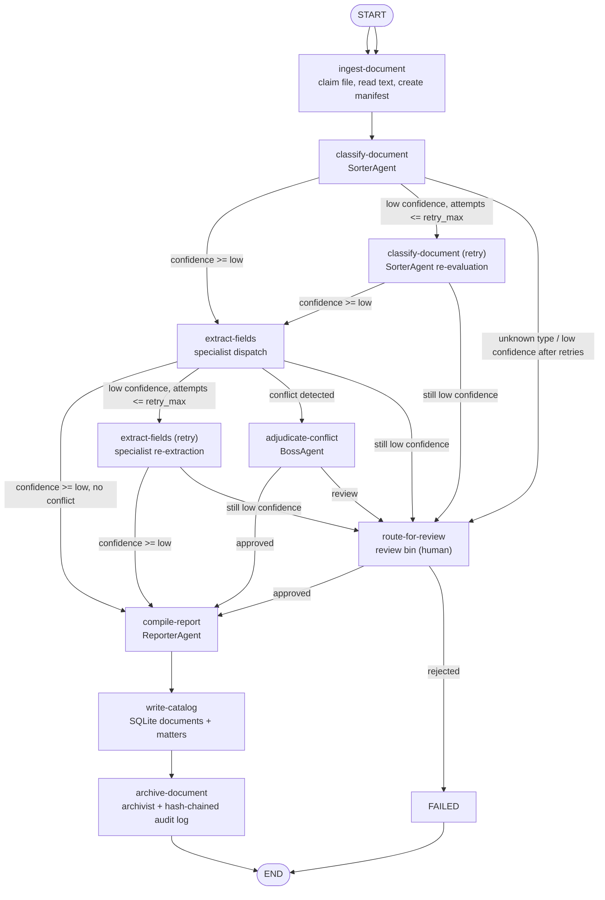
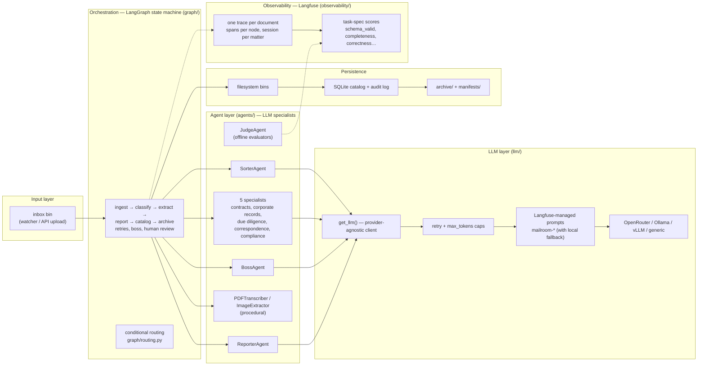

# Architecture

## Overview

Mailroom is a multi-agent legal document processing pipeline built on LangGraph. It ingests legal documents, classifies them, routes them to specialist agents for structured extraction, compiles matter records, and archives everything with a full audit trail.

## Architectural Diagram

### LangGraph state machine



### Hierarchical organization



## Core Components

### Watcher (`pipeline/watcher.py`)
- Uses `watchdog` to monitor `/pipeline/inbox/` for new files
- Debounces file events to avoid double-processing
- Claims files via atomic `os.rename` into `/pipeline/processing/<worker_id>/`
- Spawns a LangGraph run per document in a daemon thread

### LangGraph Engine (`graph/build_graph.py`)
- One graph execution per document
- 11 nodes forming a directed state machine
- SQLite-checkpointed for crash/resume
- Falls back to in-memory checkpointing when SQLite is unavailable

### LLM Client (`llm/client.py`, `llm/providers.py`, `llm/retry.py`, `llm/prompts.py`)
- Thin OpenAI-compatible wrapper
- Provider-agnostic: OpenRouter, Ollama, vLLM, or any OpenAI-compatible endpoint
- Per-agent model selection from `config/taxonomy.yaml`
- Global provider override via `DEFAULT_PROVIDER` env var
- Every chat completion goes through `retry_chat_completion` (`llm/retry.py`): transient failures (connection errors, timeouts, 429, 5xx) are retried with exponential backoff + jitter from the `llm_retry:` config; 4xx client errors are never retried
- Output generation is capped per agent by `max_tokens` in `taxonomy.yaml` (bounds runaway reasoning-token output)
- Agent system prompts are **Langfuse-managed** (`llm/prompts.py`, `mailroom-<agent_name>`), fetched at runtime with the identical template shipped in code as fallback; `scripts/sync_prompts.py` pushes templates up
- Structured calls (`_call_structured`) always send `response_format={"type": "json_object"}` and guarantee the literal token `json` in the messages — some providers (Qwen via Alibaba) reject requests without it

### SQLite (`storage/db.py`, `storage/catalog.py`, `storage/audit_log.py`)
- SQLite (via SQLAlchemy 2.0 async + aiosqlite) by default — a single file, no server required
- Shared by the document/matter catalog and the audit log
- Three tables: `matters`, `documents`, `audit_log` (`documents` carries extracted data, trace id, and a `scores` JSON column)
- `DATABASE_URL` env var can switch to Postgres

### Observability (`observability/`)
- Two interchangeable tracing backends: **Langfuse** (cloud or self-hosted, default) and **Braintrust**
- Selected via `OBSERVABILITY_PROVIDER` env (`auto` | `langfuse` | `braintrust` | `none`)
- Every LLM call is auto-traced: `llm/client.py:get_llm` wraps the OpenAI client (`langfuse.openai` patch or `braintrust.wrap_openai`), capturing prompt, response, tokens, latency
- One trace per document (`pipeline_trace`), one span per node (`traced_node`), `session_id = matter_id`, deterministic trace ids seeded from filenames
- **Scores** (`observability/scores.py`): every run emits self-evident scores (`parse_error`, `schema_valid`, `stage_completed`, confidences); pilot runs add ground-truth scores (class/stage correctness, calibration error); score configs auto-created via `ensure_score_configs()`
- **Run-log mirroring** (`scripts/sync_langfuse_logs.py`): fetch traces (with observations + scores) into `data/langfuse_logs/<run>/` for offline analysis
- Graceful noop fallback when no backend/keys are configured — pipeline runs unchanged

### Filesystem Bins (`pipeline/bins.py`)
- Human-legible pipeline state: `ls` any directory to see what's happening
- Atomic rename for claim safety (no external locking needed)
- Archive organized by `matter_id/doc_type/`

## Data Flow

### 1. Ingest
Document lands in `/pipeline/inbox/`. Watcher detects it, claims it atomically to `/pipeline/processing/<worker_id>/`. Manifest is created with `PipelineStage.PROCESSING`. PDFs are transcribed by `PDFTranscriber` — text-based PDFs directly (no LLM), scanned/garbled PDFs via an LLM markdown pass (`pipeline.pdf_direct_chars_per_page` controls the threshold).

### 2. Classify (Sorter)
LLM call: reads document text, determines `doc_type` (contract, corporate_record, due_diligence, correspondence, compliance_filing) and confidence score.

### 3. Confidence Check
Conditional edge routing (`graph/routing.py`, thresholds from `confidence:` in `taxonomy.yaml`):
- **Confidence >= `low` (0.70)**: straight to extraction
- **Confidence < `low`**: retry (`retry_classify`) while `attempts <= retry_max`
- **Still low after retry / unknown doc type**: route to `/review/` (human)

### 4. Extract (Specialist)
Dynamic dispatch to the matching specialist agent based on `doc_type`. Each specialist:
- Has its own system prompt/personality
- Uses structured JSON output against a Pydantic schema
- Returns extraction data + confidence score

### 5. Extraction Confidence Check
Same three-way branch as classification, plus a fourth path:
- **Conflict with existing matter data**: route to Boss escalation
- **Low confidence**: retry → still low → human review
- **High confidence**: proceed to report compilation

### 6. Compile Report (Reporter)
LLM call: compiles all extracted data into a clean matter-record summary.

### 7. Catalog Write
Writes document and matter records to the database (best-effort — pipeline continues on failure).

### 8. Archive (Archivist)
- Moves file to `/archive/<matter_id>/<doc_type>/`
- Writes manifest sidecar JSON
- Writes hash-chained audit log entry
- Marks manifest `PipelineStage.ARCHIVED`

## State Machine Nodes

| Node | Agent | Purpose |
|---|---|---|
| `ingest` | — | Read file, create manifest, move to processing |
| `classify` | Sorter | Determine doc_type + confidence |
| `retry_classify` | Sorter | Re-classify with alternate prompt |
| `extract` | Specialist | Extract structured data per doc-type |
| `retry_extract` | Specialist | Re-extract with context from prior attempt |
| `human_review` | — | Pause for human decision |
| `boss_escalation` | Boss (in-graph) | Adjudicate conflicts |
| `compile_report` | Reporter | Synthesize matter-record entry |
| `catalog_write` | — | Write to database catalog |
| `archive` | Archivist | Move to archive, write audit log |

## Conditional Edges

```
classify ─┬─ confidence >= low ──▶ extract
          ├─ attempts <= retry_max ──▶ retry_classify
          └─ otherwise ──▶ human_review

extract ─┬─ confidence >= low + no conflict ──▶ compile_report
         ├─ conflict detected ──▶ boss_escalation
         ├─ attempts <= retry_max ──▶ retry_extract
         └─ otherwise ──▶ human_review

boss_escalation ─┬─ approved ──▶ compile_report
                 └─ review ──▶ human_review

human_review ─┬─ approved ──▶ compile_report
              └─ rejected ──▶ END (failed)
```

## Checkpointing

LangGraph checkpoints the full state after each node. On crash or restart:
- Any in-flight run resumes from the last completed node
- No document is lost and no document is processed twice
- SQLite-backed checkpointing (`data/checkpoints.db`) is the default; MemorySaver is the fallback if SQLite is unavailable

## Audit Trail

Every state transition writes an `AuditLogEntry` to the database. Each entry:
- Contains `prev_hash` (SHA-256 of the prior entry)
- Contains `entry_hash` (SHA-256 of `prev_hash` + entry content)
- Forms a tamper-evident chain — modifying any entry breaks all subsequent hashes
- Is independent of Langfuse (the audit log is the compliance record)
- Can be verified via the `/audit/{doc_id}` API endpoint or `schemas/audit.py:verify_chain()`

## Evaluators & Quality

The `judge` agent (`agents/judge.py`, offline — not in the document graph) audits pipeline output against the task specification. `scripts/run_quality_judges.py` runs it over a pilot report and attaches scores to each sample's trace:

| Judge | Measures | Scores |
|---|---|---|
| `classification` | Is the sorter's assigned class correct for the document (audited against the taxonomy spec)? | `classification_correct`, `classification_quality` |
| `completeness` | Did the specialist capture every field the document states? | `completeness`, `completeness_label` |
| `correctness` | Are extracted values factually accurate (no fabrication)? | `extraction_correctness`, `extraction_correctness_label` |

The same rubrics are configured as **one cumulative live LLM-as-a-Judge evaluator in the Langfuse project** (`scripts/sync_evaluators.py`): the pipeline emits a single `pipeline-result` generation per document trace (`graph/build_graph.py:_emit_pipeline_result`), and one observation rule (`mailroom-pipeline-rule`) matches it — so each document costs exactly **one judge call** scoring classification correctness + extraction correctness + completeness in a single pass (evaluator `mailroom-pipeline-judge`, numeric 0-1 score + structured reasoning). The script also ensures an LLM connection for the judge provider exists (OpenRouter key from `.env`) and prunes any stale mailroom evaluators/rules.

The pilot samples are mirrored into Langfuse datasets — one **per source corpus** (`scripts/sync_dataset.py`): `mailroom-pilot` (original samples), `mailroom-pilot-legalbench`, `mailroom-pilot-atticus`, and `mailroom-pilot-pileoflaw`. One item per sample with document text, ground truth (`expected_doc_class`, `expected_stage`) and manifest metadata — for experiments and judge calibration.

Production runs additionally emit self-evident scores with no ground truth (`parse_error`, `schema_valid`, `stage_completed`, `guardrail_triggered`, confidence values) from `observability/scores.py`, and pilot runs add ground-truth scores (`class_correct`, `stage_correct`, `confidence_calibration_error`). All score configs are auto-created in Langfuse by `ensure_score_configs()`.

## Guardrails

`pipeline/guards.py` validates agent output deterministically before routing: classification must be a taxonomy enum with a `[0,1]` confidence; extractions must JSON-parse and validate against their Pydantic schema. Violations clamp confidence below the `confidence.low` routing threshold so bad output goes to retry/review, are logged, recorded on state (`extraction_guardrail`), and scored (`guardrail_triggered`).

## Logging

`pipeline/logging.py:setup_logging()` configures structlog in every entrypoint and script: level `LOG_LEVEL` (default INFO), renderer `LOG_FORMAT` (`pretty`|`json`); noisy third-party loggers silenced to WARNING.

## Boss Agent — Dual Role

The Boss agent has two separate invocation paths sharing one persona:

1. **In-graph (`boss_escalation` node)**: synchronously adjudicates conflicts within a single document's run.
2. **Ops-monitor (`pipeline/ops_monitor.py`)**: separate scheduled process (default every 5 minutes) that queries the catalog for systemic issues: stuck documents, error-rate spikes, review backlogs.
